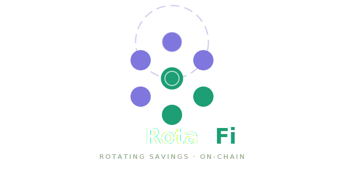

<p align="center">
  
</p>

<h1 align="center">RotaFi</h1>

<p align="center">
  <strong>Decentralized Rotating Savings on Polkadot Hub</strong>
</p>

<p align="center">
  <a href="https://dorahacks.io/hackathon/polkadot-solidity-hackathon/buidl">
    
  </a>
  
  
  
  
</p>

---

## What is RotaFi?

RotaFi brings the trusted community savings model known as **Ajo**, **Esusu**, and **Chit Funds** on-chain. Groups of participants commit to regular USDC contributions managed entirely by smart contracts no middleman, no trust required. Each cycle, one member receives the full pot, rotating until everyone has been paid out.

Built with OpenZeppelin contracts on Polkadot Hub's EVM layer, RotaFi makes community finance transparent, permissionless, and accessible to anyone with a wallet.

---

## The Problem

Rotating savings groups have existed for centuries across Africa, Asia, and Latin America. They work but they depend entirely on trust between members and a human organizer who can disappear with the funds, miss a payout, or simply make mistakes. There is no transparency, no enforcement, and no recourse.

RotaFi removes the human middleman and replaces trust with code.

---

## How It Works

1. **Create a circle** — a group admin deploys a new savings circle, sets the contribution amount (in USDC), the cycle duration, and the number of members.
2. **Members join** — participants join by connecting their wallet. The circle locks once the member cap is reached.
3. **Contribute each cycle** — every member deposits their USDC contribution before the cycle deadline.
4. **Automatic payout** — at the end of each cycle, the smart contract sends the full pot to the designated recipient for that round.
5. **Rotation continues** — the cycle repeats, rotating through all members until everyone has received their payout.
6. **Late penalties** — members who miss a contribution deadline are penalized; funds are held until they pay up.

---

## Smart Contracts

| Contract | Description |
|---|---|
| `SavingsCircle.sol` | Core logic — contributions, cycle management, payout rotation, and penalties |
| `CircleFactory.sol` | Factory pattern to deploy unlimited independent circle instances |

### OpenZeppelin Libraries Used

- `ERC20` — USDC token interface for contributions and payouts
- `AccessControl` — role-based permissions for circle admin and members
- `ReentrancyGuard` — protection against reentrancy attacks on payout functions
- `Pausable` — emergency pause mechanism for the contract owner

---

## Tech Stack

| Layer | Technology |
|---|---|
| Smart Contracts | Solidity ^0.8.20 |
| Contract Libraries | OpenZeppelin Contracts |
| Network | Polkadot Hub (EVM) |
| Development | Hardhat |
| Testing | Hardhat + Ethers.js |
| Frontend | React + Ethers.js |
| Wallet | MetaMask (EVM compatible) |
| Stablecoin | USDC |

---

## Project Structure

```
rotafi/
├── contracts/
│   ├── SavingsCircle.sol
│   └── CircleFactory.sol
├── scripts/
│   ├── deploy.js
│   └── seed.js
├── test/
│   ├── SavingsCircle.test.js
│   └── CircleFactory.test.js
├── frontend/
│   ├── src/
│   │   ├── components/
│   │   ├── hooks/
│   │   └── App.jsx
│   └── package.json
├── assets/
│   └── logo.svg
├── hardhat.config.js
├── package.json
└── README.md
```

---

## Getting Started

### Prerequisites

- Node.js v18+
- MetaMask browser extension
- Polkadot Hub testnet configured in MetaMask

### Installation

```bash
git clone https://github.com/mikky69/rotafi.git
cd rotafi
npm install
```

### Configure environment

```bash
cp .env.example .env
```

Fill in your `.env`:

```env
PRIVATE_KEY=your_wallet_private_key
POLKADOT_HUB_RPC=https://westend-asset-hub-eth-rpc.polkadot.io
USDC_ADDRESS=deployed_usdc_contract_address
```

### Run tests

```bash
npx hardhat test
```

### Deploy to Polkadot Hub testnet

```bash
npx hardhat run scripts/deploy.js --network polkadotHub
```

### Run the frontend

```bash
cd frontend
npm install
npm run dev
```

---

## Polkadot Hub Integration

RotaFi is deployed on **Polkadot Hub's native EVM layer**, powered by **PolkaVM**. This gives RotaFi access to:

- **Shared security** from the Polkadot relay chain
- **Low transaction fees** compared to Ethereum mainnet
- **Cross-chain potential** via Polkadot's XCM messaging protocol
- **EVM compatibility** allowing standard Solidity tooling (Hardhat, MetaMask, OpenZeppelin) with no modifications

---

## Roadmap

- [x] Core savings circle contract
- [x] Factory deployment pattern
- [x] Frontend MVP
- [ ] Multi-token support (DOT, other stablecoins)
- [ ] Cross-chain circle membership via XCM
- [ ] On-chain reputation score for members
- [ ] Mobile-first PWA

---

## Team

Built during the **Polkadot Solidity Hackathon 2026**, organized by OpenGuild and the Web3 Foundation.

---
